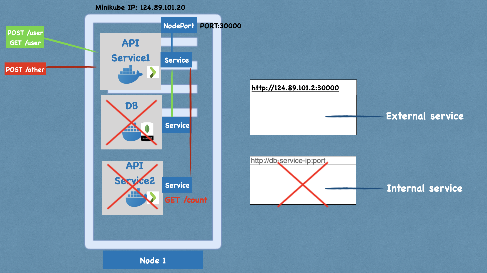
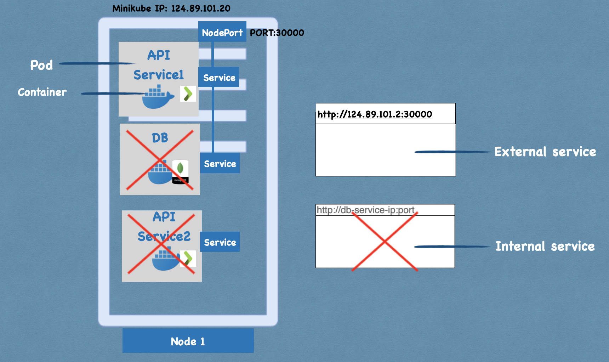

this project is a copy of https://gitlab.com/moneletizi/kubernetes-mongo_play-setup

## Execution
To execute with minikube go in project root folder and type following commands:
```bash
minikube start
./mongorun.sh
kubectl apply -f apiservice.yaml
kubectl apply -f countservice.yaml
```
## Overview 




## Drawbacks
The mongodb container is encapsulated by a pod. Whatever data is saved stays within the internal filesystem of the container.
Now, if for some reason, the container crashes or the pod encapsulating the container goes down, all data persisted inside the filesystem will be lost.
Upon crashing, Kubernetes will create a new pod to maintain the desired state, but there is no data carry over mechanism between the two pods whatsoever.


the images above are taken from [freecodecamp](https://www.freecodecamp.org/news/the-kubernetes-handbook/)
